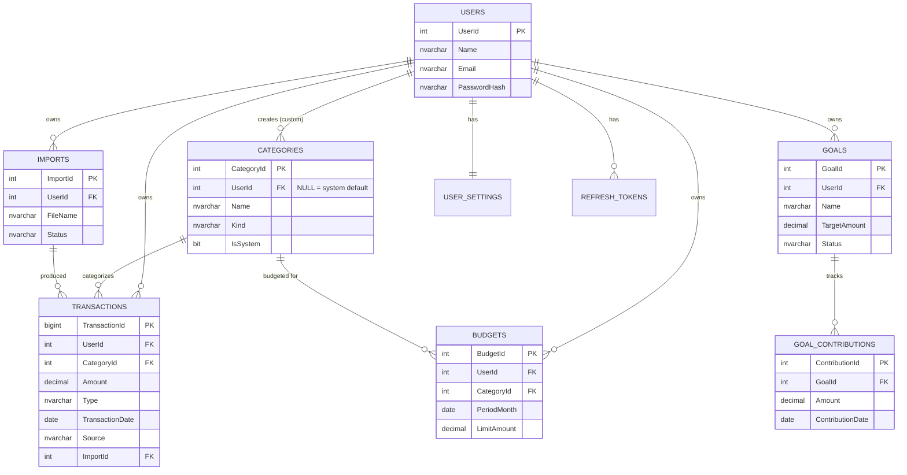

# Database Design

Target engine: **Microsoft SQL Server** (Azure SQL in production), per Project-Overview.md's tech stack decision. Table and column names use PascalCase, which is the standard SQL Server convention — this is intentionally separate from the camelCase/PascalCase split defined for application code in NFR-5.4 (Non-Functional-Requirements.md); that rule governs TypeScript, not SQL DDL.

Each table is tagged `TBL-x` for traceability from Architecture.md / API-Design.md.

## Design Principles

These are non-negotiable constraints carried over from Non-Functional-Requirements.md — every table below is designed to satisfy them, not bolted on after:

| Principle | Enforced by |
|---|---|
| Every user-owned row must be scoped/queryable by `UserId` | `UserId` foreign key + index on every owned table — *NFR-2.3* |
| Budget/goal progress is never a stored running total, always derived from source rows | No `SpentAmount` or `CurrentAmount` column on `Budgets`/`Goals` — see "Derived Values" section — *NFR-4.3* |
| Deleting a category with existing transactions must not corrupt data | `Categories` includes a non-deletable system "Uncategorized" row; reassignment handled at the service layer — *NFR-4.2* |
| A failed import must not partially write transactions | `Transactions.ImportId` + application-level DB transaction wrapping the whole batch insert — *NFR-4.1* |
| Large transaction tables must paginate efficiently | Composite index on `(UserId, TransactionDate)` — *NFR-6.1, NFR-1.1* |
| No real account numbers / sensitive bank data | `AccountSource` is a free-text masked string only (e.g. `**** 4821`), never a real PAN — *NFR-8.1, NFR-8.2* |

---

## Entity-Relationship Diagram



---

## TBL-1: Users
*(FR-1.1, FR-1.3, FR-1.7)*

```sql
CREATE TABLE Users (
    UserId         INT IDENTITY(1,1) PRIMARY KEY,
    Name           NVARCHAR(100)  NOT NULL,
    Email          NVARCHAR(255)  NOT NULL,
    PasswordHash   NVARCHAR(255)  NOT NULL,
    CreatedAt      DATETIME2      NOT NULL DEFAULT SYSUTCDATETIME(),
    UpdatedAt      DATETIME2      NULL,
    CONSTRAINT UQ_Users_Email UNIQUE (Email)
);
```
`PasswordHash` stores a bcrypt hash only — plaintext is never written or logged, per *NFR-2.1*.

## TBL-2: RefreshTokens
*(FR-1.4, FR-1.5, FR-1.6, NFR-2.7)*

```sql
CREATE TABLE RefreshTokens (
    RefreshTokenId INT IDENTITY(1,1) PRIMARY KEY,
    UserId         INT            NOT NULL,
    TokenHash      NVARCHAR(255)  NOT NULL,
    ExpiresAt      DATETIME2      NOT NULL,
    RevokedAt      DATETIME2      NULL,
    CreatedAt      DATETIME2      NOT NULL DEFAULT SYSUTCDATETIME(),
    CONSTRAINT FK_RefreshTokens_Users FOREIGN KEY (UserId) REFERENCES Users(UserId) ON DELETE CASCADE
);
```
Only a hash of the refresh token is stored (never the raw token), so a DB leak alone can't be used to forge sessions. Logout (UF-3) sets `RevokedAt`; expired/revoked rows can be purged by a periodic cleanup job.

## TBL-3: UserSettings
*(FR-1.9, US-9.1)*

```sql
CREATE TABLE UserSettings (
    UserId                          INT           PRIMARY KEY,
    Currency                        NVARCHAR(3)   NOT NULL DEFAULT 'INR',
    EmailNotificationsEnabled       BIT           NOT NULL DEFAULT 1,
    BudgetAlertNotificationsEnabled BIT           NOT NULL DEFAULT 1,
    UpdatedAt                       DATETIME2     NULL,
    CONSTRAINT FK_UserSettings_Users FOREIGN KEY (UserId) REFERENCES Users(UserId) ON DELETE CASCADE
);
```
One row per user, created automatically at registration (UF-1) with sensible defaults — so `settings.html` never needs to handle a "no settings row exists yet" empty state.

## TBL-4: Categories
*(FR-3.8, NFR-4.2)*

```sql
CREATE TABLE Categories (
    CategoryId  INT IDENTITY(1,1) PRIMARY KEY,
    UserId      INT            NULL,  -- NULL = system-wide default, visible to all users
    Name        NVARCHAR(50)   NOT NULL,
    Kind        NVARCHAR(10)   NOT NULL DEFAULT 'expense',
    ColorHex    NVARCHAR(7)    NULL,
    IsSystem    BIT            NOT NULL DEFAULT 0,
    CreatedAt   DATETIME2      NOT NULL DEFAULT SYSUTCDATETIME(),
    CONSTRAINT FK_Categories_Users FOREIGN KEY (UserId) REFERENCES Users(UserId) ON DELETE CASCADE,
    CONSTRAINT CK_Categories_Kind CHECK (Kind IN ('income', 'expense', 'both'))
);
```
A single system row named **Uncategorized** (`IsSystem = 1`, `UserId = NULL`) is seeded once and is the same row every user's orphaned transactions fall back to. The application layer blocks deletion of any row where `IsSystem = 1`, and for user-created categories, reassigns existing transactions to Uncategorized *before* allowing the delete — this is what satisfies *NFR-4.2*; it's deliberately not a DB-level `ON DELETE SET NULL`, because "reassign to Uncategorized" is a business rule, not a null.

## TBL-5: Transactions
*(FR-3.1 – FR-3.9, FR-4.x, NFR-1.1, NFR-6.1)*

```sql
CREATE TABLE Transactions (
    TransactionId    BIGINT IDENTITY(1,1) PRIMARY KEY,
    UserId           INT            NOT NULL,
    CategoryId       INT            NOT NULL,
    AccountSource    NVARCHAR(50)   NULL,   -- e.g. masked "**** 4821", never a real account number
    Merchant         NVARCHAR(150)  NOT NULL,
    Notes            NVARCHAR(500)  NULL,
    Amount           DECIMAL(12,2)  NOT NULL,
    Type             NVARCHAR(7)    NOT NULL,
    TransactionDate  DATE           NOT NULL,
    Source           NVARCHAR(10)   NOT NULL DEFAULT 'manual',
    ImportId         INT            NULL,
    CreatedAt        DATETIME2      NOT NULL DEFAULT SYSUTCDATETIME(),
    UpdatedAt        DATETIME2      NULL,
    CONSTRAINT FK_Transactions_Users      FOREIGN KEY (UserId) REFERENCES Users(UserId) ON DELETE CASCADE,
    CONSTRAINT FK_Transactions_Categories FOREIGN KEY (CategoryId) REFERENCES Categories(CategoryId),
    CONSTRAINT FK_Transactions_Imports    FOREIGN KEY (ImportId) REFERENCES Imports(ImportId) ON DELETE SET NULL,
    CONSTRAINT CK_Transactions_Type   CHECK (Type IN ('income', 'expense')),
    CONSTRAINT CK_Transactions_Source CHECK (Source IN ('manual', 'import')),
    CONSTRAINT CK_Transactions_Amount CHECK (Amount > 0)
);
```
`Amount` is always stored positive; the `Type` column (not the sign) determines whether it's added or subtracted in any aggregate, per *FR-3.9*. `Source`/`ImportId` together answer "was this row manually entered or imported, and by which batch" — needed for import history (UF-7) and for excluding/including rows during duplicate detection on future imports.

## TBL-6: Imports
*(FR-4.6, FR-4.8, NFR-4.1)*

```sql
CREATE TABLE Imports (
    ImportId    INT IDENTITY(1,1) PRIMARY KEY,
    UserId      INT            NOT NULL,
    FileName    NVARCHAR(255)  NOT NULL,
    RowCount    INT            NOT NULL DEFAULT 0,
    Status      NVARCHAR(10)   NOT NULL,
    ImportedAt  DATETIME2      NOT NULL DEFAULT SYSUTCDATETIME(),
    CONSTRAINT FK_Imports_Users FOREIGN KEY (UserId) REFERENCES Users(UserId) ON DELETE CASCADE,
    CONSTRAINT CK_Imports_Status CHECK (Status IN ('success', 'failed'))
);
```
A row is only written here, and its `Transactions` only committed, inside the *same* application-level DB transaction (UF-7, step 7) — so a `Status = 'failed'` import never has associated `Transactions` rows, satisfying the all-or-nothing rule in *NFR-4.1*.

## TBL-7: Budgets
*(FR-5.1 – FR-5.8, NFR-4.3)*

```sql
CREATE TABLE Budgets (
    BudgetId     INT IDENTITY(1,1) PRIMARY KEY,
    UserId       INT            NOT NULL,
    CategoryId   INT            NOT NULL,
    PeriodMonth  DATE           NOT NULL,  -- always stored as the first day of the month, e.g. 2026-06-01
    LimitAmount  DECIMAL(12,2)  NOT NULL,
    CreatedAt    DATETIME2      NOT NULL DEFAULT SYSUTCDATETIME(),
    UpdatedAt    DATETIME2      NULL,
    CONSTRAINT FK_Budgets_Users      FOREIGN KEY (UserId) REFERENCES Users(UserId) ON DELETE CASCADE,
    CONSTRAINT FK_Budgets_Categories FOREIGN KEY (CategoryId) REFERENCES Categories(CategoryId),
    CONSTRAINT UQ_Budgets_User_Category_Month UNIQUE (UserId, CategoryId, PeriodMonth),
    CONSTRAINT CK_Budgets_Limit CHECK (LimitAmount > 0)
);
```
One row per category per month, by design — this is what makes "view past months' budget performance" (FR-5.6) a plain `WHERE PeriodMonth < @currentMonth` query rather than needing a separate history/snapshot table. There is intentionally **no `SpentAmount` column** — see Derived Values below.

## TBL-8: Goals
*(FR-6.1, FR-6.2, FR-6.5, FR-6.6, FR-6.7)*

```sql
CREATE TABLE Goals (
    GoalId        INT IDENTITY(1,1) PRIMARY KEY,
    UserId        INT            NOT NULL,
    Name          NVARCHAR(100)  NOT NULL,
    TargetAmount  DECIMAL(12,2)  NOT NULL,
    TargetDate    DATE           NULL,
    Status        NVARCHAR(10)   NOT NULL DEFAULT 'active',
    AchievedAt    DATETIME2      NULL,
    CreatedAt     DATETIME2      NOT NULL DEFAULT SYSUTCDATETIME(),
    UpdatedAt     DATETIME2      NULL,
    CONSTRAINT FK_Goals_Users FOREIGN KEY (UserId) REFERENCES Users(UserId) ON DELETE CASCADE,
    CONSTRAINT CK_Goals_Status CHECK (Status IN ('active', 'achieved', 'archived')),
    CONSTRAINT CK_Goals_Target CHECK (TargetAmount > 0)
);
```
`Status` transitions `active → achieved` automatically (service layer, not a trigger) the moment contributions sum to ≥ `TargetAmount` — this is what drives the gold-ribbon state in UF-9. `archived` is a separate, user-initiated transition (FR-6.7) and doesn't require `achieved` first, since a user might abandon a goal early.

## TBL-9: GoalContributions
*(FR-6.3, FR-6.4, NFR-4.3)*

```sql
CREATE TABLE GoalContributions (
    ContributionId    INT IDENTITY(1,1) PRIMARY KEY,
    GoalId            INT            NOT NULL,
    Amount            DECIMAL(12,2)  NOT NULL,
    ContributionDate  DATE           NOT NULL,
    CreatedAt         DATETIME2      NOT NULL DEFAULT SYSUTCDATETIME(),
    CONSTRAINT FK_GoalContributions_Goals FOREIGN KEY (GoalId) REFERENCES Goals(GoalId) ON DELETE CASCADE,
    CONSTRAINT CK_GoalContributions_Amount CHECK (Amount > 0)
);
```

---

## Derived Values — Never Stored

Per *NFR-4.3*, the following are always computed on read, never written as a column, so the displayed number can never drift from reality:

| Value | Computed as |
|---|---|
| Budget "spent" amount | `SUM(Transactions.Amount)` WHERE `CategoryId` = budget's category, `Type = 'expense'`, `TransactionDate` falls within `PeriodMonth`, same `UserId` |
| Goal "current amount" | `SUM(GoalContributions.Amount)` WHERE `GoalId` = goal's id |
| Dashboard total balance | `SUM(income transactions) − SUM(expense transactions)` for the user, all time (or scoped if accounts become first-class — see Open Questions) |
| Current month income / expense + % vs. last month | `SUM` per type for current month vs. prior month, percentage difference calculated in application code |
| Savings rate | `(Income − Expense) / Income` for the selected period |
| Goal "achieved" trigger | Recomputed after every contribution insert: if current amount ≥ `TargetAmount` and `Status = 'active'`, flip to `'achieved'` and stamp `AchievedAt` |

---

## Indexing Strategy
*(NFR-1.1, NFR-1.3, NFR-6.1)*

```sql
CREATE UNIQUE INDEX UQ_Users_Email_IDX        ON Users(Email);
CREATE INDEX IX_Transactions_User_Date         ON Transactions(UserId, TransactionDate DESC);
CREATE INDEX IX_Transactions_User_Category     ON Transactions(UserId, CategoryId);
CREATE INDEX IX_Transactions_Merchant          ON Transactions(Merchant);
CREATE INDEX IX_Budgets_User_Period            ON Budgets(UserId, PeriodMonth);
CREATE INDEX IX_GoalContributions_GoalId       ON GoalContributions(GoalId);
CREATE INDEX IX_RefreshTokens_User             ON RefreshTokens(UserId);
```
`IX_Transactions_User_Date` is the one doing the most work: it backs the dashboard's recent-transactions widget, the paginated transaction list, and the date-range filter (UF-6) all at once, which is why `NFR-6.1` calls it out specifically.

## Referential Integrity Summary

| Action | Behavior |
|---|---|
| Delete a `User` | Cascades to `RefreshTokens`, `UserSettings`, `Transactions`, `Budgets`, `Goals` (and `GoalContributions` via `Goals`). Account deletion isn't an exposed feature in v1, but the schema doesn't leave orphaned rows if it's ever added. |
| Delete a user-created `Category` | Blocked at the service layer until transactions are reassigned to Uncategorized (*NFR-4.2*) — no DB-level cascade. |
| Delete the system `Uncategorized` category | Blocked unconditionally (`IsSystem = 1` check in the service layer). |
| Delete an `Import` | Not an exposed feature in v1; FK uses `ON DELETE SET NULL` defensively so it can't orphan-delete real transaction history if added later. |
| Delete a `Goal` | Cascades to its `GoalContributions` — a goal's contribution log has no meaning without the goal. |

## Seed Data

A fixed set of system categories (`IsSystem = 1`, `UserId = NULL`) is inserted via migration, matching the categories visible in the reviewed `dashboard.html`:

| Name | Kind |
|---|---|
| Food & Dining | expense |
| Transport | expense |
| Shopping | expense |
| Bills & Utilities | expense |
| Entertainment | expense |
| Health | expense |
| Income | income |
| Uncategorized | both |

Users can add their own categories on top of this list (`Categories.UserId` set to their own id); they cannot edit or delete the system rows.

---

## Open Questions / Needs Confirmation
1. **Accounts as a first-class entity** (also flagged in Functional-Requirements.md): this design keeps `AccountSource` as a free-text column on `Transactions`. If a later phase needs true multi-account balances or per-account filtering, this would need to split into a separate `Accounts` table with a FK from `Transactions` — confirm this is acceptable for v1 before any UI commits to "account" as a dropdown of free text.
2. **Category sharing model:** this design uses a single shared set of system categories (`UserId = NULL`) plus per-user custom categories. Confirm this matches the intended UX in `settings.html`/category-management screens, versus each user getting their own private copy of the default set at registration.
3. **Budget rollover:** `Budgets` requires a new row per category per month. Confirm whether the product should auto-create next month's budget row (copying the prior month's limit) when the month rolls over, or require the user to set each month manually — affects whether a scheduled job is needed.
4. **Soft delete vs. hard delete:** transactions, budgets, and goals currently use hard deletes (`DELETE` removes the row). If an audit trail or "undo" feature is wanted later, these would need an `IsDeleted` flag instead — out of scope for v1 per the project's portfolio-appropriate scope (NFR-6 in Non-Functional-Requirements.md), but worth flagging before the API layer is built around hard deletes.