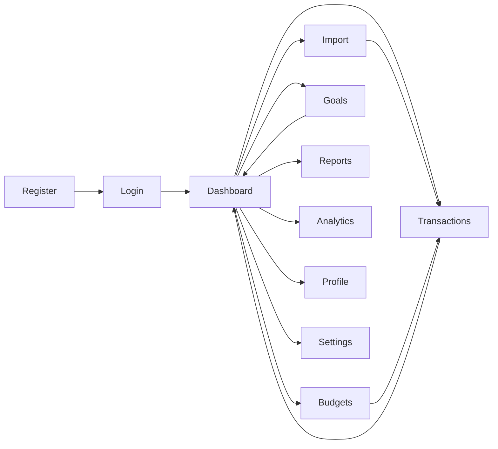
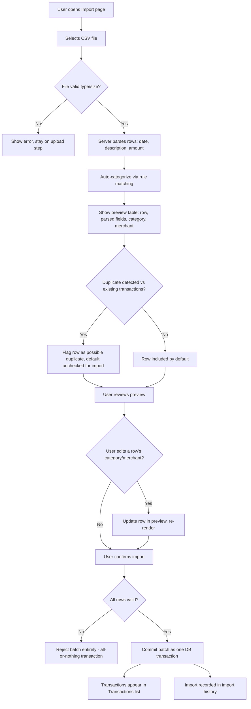

# User Flow

This document maps the step-by-step paths a user takes through FinTrack-Pro, end to end. Where a flow exists primarily to satisfy a requirement, it references the relevant `FR-x.x` (Functional-Requirements.md) and `US-x.x` (User-Stories.md) IDs for traceability. Flows are written against the 11 confirmed prototype pages.

Each flow has an ID (`UF-x`) so it can be referenced from Architecture.md or API-Design.md later (e.g., "the import preview step in UF-7 requires a `POST /imports/:id/preview` endpoint").

---

## 0. Site Map (Page-Level Navigation)

| Page | Reachable from | Auth required |
|---|---|---|
| `login.html` | Direct link, logout redirect, expired-session redirect | No |
| `register.html` | Login page link | No |
| `dashboard.html` | Sidebar (default landing page after login) | Yes |
| `transactions.html` | Sidebar, "View All" on dashboard recent-transactions widget | Yes |
| `import-bank-statement.html` | Sidebar, quick-action on dashboard | Yes |
| `budgets.html` | Sidebar, "View Budgets" on dashboard budget widget | Yes |
| `goals.html` | Sidebar, "View Goals" on dashboard goals widget | Yes |
| `analytics.html` | Sidebar | Yes |
| `reports.html` | Sidebar, quick-action on dashboard | Yes |
| `profile.html` | Avatar/account menu | Yes |
| `settings.html` | Avatar/account menu | Yes |

---

## UF-1: First-Time User Onboarding
*(US-1.1, FR-1.1, FR-1.3)*

1. User lands on `login.html`, clicks "Create an account."
2. User is taken to `register.html` and enters name, email, password.
3. Client-side validation runs (required fields, email format, password strength) — *FR-9.4*.
4. On submit, backend hashes the password (bcrypt) and creates the user record — *FR-1.3*.
5. **Success:** user is auto-logged-in (or redirected to login with a "registration successful" message — **decision needed**, see Open Questions) and lands on `dashboard.html` in its **empty state**: ₹0 balance, "No transactions yet" placeholder, "Get started" quick actions (Add Transaction / Import Statement / Create Budget / Create Goal).
6. **Failure** (duplicate email, weak password): inline field error shown per *NFR-3.3* — no generic alert popup.

---

## UF-2: Returning User Login
*(US-1.2, FR-1.2, FR-1.4, FR-1.5)*

1. User opens the app, lands on `login.html` if no valid session exists.
2. User enters email + password.
3. Backend validates credentials, issues a JWT access token + refresh token (httpOnly cookie, *NFR-2.7*).
4. User is redirected to `dashboard.html`, populated with their real data.
5. On subsequent visits within the refresh-token's validity window, the user skips the login screen entirely and lands straight on the dashboard — *US-1.3, FR-1.5*.
6. **Failure** (wrong password, unknown email): a single generic "Invalid email or password" inline error — deliberately non-specific so the flow doesn't leak which field was wrong.

---

## UF-3: Session Expiry & Logout
*(US-1.4, FR-1.6)*

1. **Manual logout:** user opens the account menu → "Log out." Refresh token is invalidated server-side; client clears the access token; user is redirected to `login.html`.
2. **Automatic expiry:** an API call returns 401 because the access token expired and silent refresh also failed (refresh token expired/revoked). The frontend redirects to `login.html` with a "Your session expired, please log in again" message rather than showing a broken/blank page.

---

## UF-4: Manual Transaction Entry
*(US-3.2, FR-3.3)*

1. User clicks "Add Transaction" (from dashboard quick action or `transactions.html`).
2. A form/modal opens: date, amount, type (income/expense), category, merchant, optional notes.
3. Validation runs inline (amount must be numeric and > 0, date required, category required) — *FR-9.4*.
4. On submit, the transaction is saved and immediately reflected in: the transaction list, the relevant budget's spent amount (*FR-5.8*), and dashboard totals on next visit.
5. Income vs. expense is visually distinguished by color/sign throughout — *FR-3.9*.

---

## UF-5: Edit / Delete a Transaction
*(US-3.3, US-3.4, US-3.7, FR-3.4, FR-3.5, FR-3.8)*

1. From `transactions.html`, user selects a row → Edit or Delete action.
2. **Edit:** same form as UF-4, pre-filled. Changing the category re-triggers budget recalculation for both the old and new category (so neither is left over- or under-counted) — relates to *NFR-4.3*.
3. **Delete:** confirmation prompt ("Delete this transaction? This can't be undone") before removal — prevents accidental data loss.
4. **Re-categorize only** (no other field changed): same edit path, used specifically to fix an auto-categorization mistake from import — *US-3.7*.

---

## UF-6: Filter & Search Transactions
*(US-3.5, US-3.6, FR-3.6, FR-3.7)*

1. On `transactions.html`, user applies filters: category (multi-select), date range, and/or account.
2. User can additionally type a merchant name into a search box; results update to matching rows only.
3. Filters and search can combine (e.g., "Food" category + "last 30 days" + "Swiggy").
4. Empty result set shows an intentional empty state ("No transactions match these filters") rather than a blank table — *NFR-3.4*.

---

## UF-7: Bank Statement Import
*(US-4.1 – US-4.6, FR-4.1 – FR-4.6, FR-4.8, NFR-2.4, NFR-4.1)*

This is the most branching flow in the app — it has the most decision points and failure paths.

1. User opens `import-bank-statement.html` and selects a CSV file (v1 supports CSV only — *NFR-9.1*; PDF/OFX explicitly deferred — *NFR-9.2, FR-4.7*).
2. File type and size are validated before any processing — *NFR-2.4*.
3. Server parses rows and runs rule-based auto-categorization (e.g., "SWIGGY" → Food) — *FR-4.3*.
4. A preview table is shown before anything is saved — *US-4.3, FR-4.4*. This is a hard requirement: nothing is written to the user's real transaction data until they explicitly confirm.
5. Rows that look like duplicates of already-imported transactions are flagged (not auto-removed) so the user makes the final call — *US-4.5, FR-4.6*.
6. User can correct a misread category or merchant name directly in the preview — *US-4.4, FR-4.5*.
7. On confirm, the entire batch commits as a single database transaction — either all rows save or none do, so a mid-import failure can't leave the user with a half-imported, inconsistent statement — *NFR-4.1*.
8. The import is logged in import history (filename, date, row count) so the user can later see what's already been added — *US-4.6, FR-4.8*.

---

## UF-8: Budget Creation & Monitoring
*(US-5.1 – US-5.7, FR-5.1 – FR-5.8, NFR-4.3)*

1. User goes to `budgets.html`, clicks "New Budget," selects a category and sets a monthly limit — *FR-5.1*.
2. The page shows an overview ring (total budget usage across all categories) plus per-category cards with a spent/limit progress bar — *FR-5.2, FR-5.3*.
3. As transactions are added or imported into that category, the budget's spent amount recalculates automatically from underlying transaction data — never a manually-edited running total — *FR-5.8, NFR-4.3*.
4. **At ~80% of limit:** category card shifts into a warning visual state — *US-5.4, FR-5.4*.
5. **At/above 100% of limit:** category card shifts into an over-limit alert state — *US-5.5, FR-5.5*.
6. User can view past months' budget performance via a history view — *US-5.6, FR-5.6*.
7. User can edit the limit or delete the budget entirely — *FR-5.7*.
8. **Edge case:** if the user deletes a category that has existing transactions, the system reassigns those transactions to "Uncategorized" rather than corrupting/orphaning them — *NFR-4.2*.

---

## UF-9: Goal Creation, Contribution & Achievement
*(US-6.1 – US-6.6, FR-6.1 – FR-6.7)*

1. User goes to `goals.html`, clicks "New Goal," sets a name, target amount, and optional target date — *FR-6.1*.
2. Goal renders as a progress ring matching the dashboard's ring pattern — *FR-6.2*.
3. User logs a contribution (amount + date) toward the goal — *US-6.3, FR-6.3*. Progress is always derived from the sum of contributions, never a manually-set percentage — same drift-prevention principle as budgets (*NFR-4.3*).
4. User can view the full contribution history/log for a goal — *US-6.4, FR-6.4*.
5. **On reaching 100%:** the goal transitions to an "achieved" visual state with the gold ribbon treatment — *US-6.5, FR-6.5*.
6. User can archive an achieved goal to move it out of the active list — *FR-6.7* (P1).
7. User can edit goal details or delete the goal at any point — *US-6.6, FR-6.6*.

---

## UF-10: Analytics Exploration
*(US-7.1 – US-7.3, FR-7.1 – FR-7.5)*

1. User opens `analytics.html`.
2. Default view shows a category breakdown (pie/donut) for the current period and a multi-month spending trend line — *FR-7.1, FR-7.2*.
3. User can change the date range and/or filter by account/category to drill in — *FR-7.5* (P1).
4. User can view top merchants by total spend — *US-7.3, FR-7.4* (P1).
5. (Open question, see Functional-Requirements.md: whether any of this duplicates dashboard charts or is strictly additive.)

---

## UF-11: Report Generation & Export
*(US-8.1 – US-8.3, FR-8.1 – FR-8.4)*

1. User opens `reports.html`, selects a custom date range — *US-8.1, FR-8.1*.
2. System generates a report: summary totals (income, expenses, savings) plus category breakdown — *FR-8.4*.
3. User exports as PDF for a clean, shareable summary — *US-8.2, FR-8.2*.
4. User exports raw transactions as Excel/CSV for further analysis outside the app — *US-8.3, FR-8.3*.

---

## UF-12: Profile Update & Password Change
*(US-1.5, US-1.6, FR-1.7, FR-1.8)*

1. User opens the account menu → `profile.html`.
2. User edits name/email and saves — *FR-1.7*.
3. User changes password via a dedicated form requiring current password + new password (+ confirmation) — *FR-1.8*.
4. On success, a confirmation message displays inline; on failure (wrong current password, mismatched confirmation), inline validation errors per *NFR-3.3*.

---

## UF-13: Settings Configuration
*(US-9.1, FR-1.9)*

1. User opens the account menu → `settings.html`.
2. User configures currency display and notification preferences — *FR-1.9* (P1).
3. Changes apply immediately and persist across sessions.

---

## Cross-Cutting Flow Rules

| Rule | Applies to | Source |
|---|---|---|
| Every data fetch (transactions, budgets, goals) is scoped server-side to the logged-in user's ID, regardless of what the client requests | All authenticated flows | NFR-2.3, FR-9.2 |
| Validation errors render inline at the field level, never as a generic alert popup | All forms | NFR-3.3 |
| Empty states (no transactions, no budgets, no goals yet) are intentionally designed, not blank | Dashboard, Transactions, Budgets, Goals | NFR-3.4 |
| Destructive actions (delete transaction, delete budget, delete goal) require a confirmation step | Transactions, Budgets, Goals | Standard UX safety pattern |

---

## Open Questions / Needs Confirmation
1. After registration, does the user land directly on the dashboard (auto-login), or are they redirected back to `login.html` to sign in manually?
2. In UF-7, if a flagged "possible duplicate" is left unchecked by the user, is it silently skipped on import or does the system require an explicit per-row decision before allowing confirm?
3. Does archiving a goal (FR-6.7) move it to a separate "Archived Goals" view, or simply collapse it out of the default list with a toggle to show archived items?
4. For Analytics vs. Dashboard chart overlap (also flagged in Functional-Requirements.md) — once `analytics.html` is reviewed in raw form, confirm whether this flow needs its own filter state or can share the dashboard's date-range component.